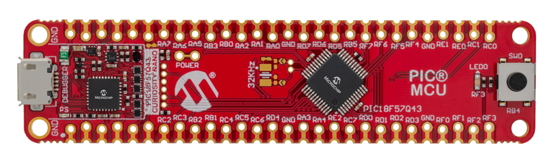
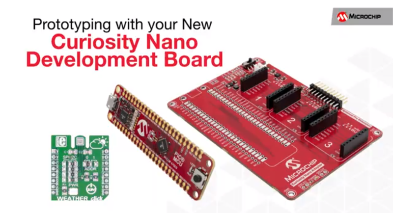

# Projet  CuriosityNano-PIC18F57Q43

<html>
<!-- Tableau simple avec en-tête -->

<a href="https://docs.google.com/document/d/1mcOm10D477hyFiMuCVZdUryhYyRF4xZHGxpxrDaOEMk/edit?usp=sharing" title="Curiosity Nano Development Platform" target="_blank">
<table style="margin-left: auto; margin-right: auto;">
  <tr>
    <td></td>
    <td>PIC18F57Q43 Curiosity Nano Evaluation Kit</td>
  </tr>
</table>

</a>

</html>

<!--  -->

---

<html>

<a href="https://www.microchip.com/design-centers/8-bit/development-tools/pic-hardware/curiosity-nano-development-platform" title="Curiosity Nano Development Platform" target="_blank">
<H2>Curiosity Nano Development Platform</H2>

</a>

</html>

---

## Matériels nécessaires

* Une carte PIC18F57Q43 Curiosity Nano (vous pouvez la trouver sur Microchip Direct, mais aussi sur Mouser, Digikey et d'autres magasins de composants électroniques en ligne en recherchant le code DM164150)
* Un câble USB type A vers USB micro B (probablement celui que vous utilisez pour votre téléphone portable convient également à moins que vous n'ayez un téléphone portable USB type C ou un iPhone...)
* La dernière version de MPLAB X IDE, ici la version utilisée est la [v5.45](https://www.microchip.com/mplab/mplab-x-ide)
* La dernière version du compilateur XC8, la version utilisée est la [v2.31](https://www.microchip.com/en-us/development-tools-tools-and-software/mplab-xc-compilers#MPLAB%20XC%20Compiler%20Choices) (celle-ci est utilisé à la fois pour les PIC et les AVR)
* La documentation (manuel d'utilisation et schéma) de la carte, [disponible sur le site du fabricant](https://www.microchip.com/developmenttools/ProductDetails/DM164150)

### Mise en oeuvre de l'UART

#### Terminal sérial

    __FILE__: main.c
    __LINE__: 83
    __func__: main
    __DATE__: Dec 13 2020
    __TIME__: 23:43:47
    __VERSION__: 4.2.1 Compatible Clang 4.0.1 (tags/RELEASE_401/final)
    __COUNTER__:
    BUTTON PRESSED
    ...

---

## Liens Internet

* Microchip, [PIC18F57Q43 Curiosity Nano Evaluation Kit - Part Number: DM164150](https://www.microchip.com/developmenttools/ProductDetails/DM164150)
* Blog, [PIC18F57Q43 Curiosity Nano + MPLAB Code Configurator](https://www.settorezero.com/wordpress/curiosity-nano-code-configurator-per-entrare-nel-mondo-dei-microcontrollori-pic-senza-sforzo-e-in-economia/)
* GitHub, [Cyb3rn0id / Microchip_Curiosity_Nano_Examples](https://github.com/Cyb3rn0id/Microchip_Curiosity_Nano_Examples)
